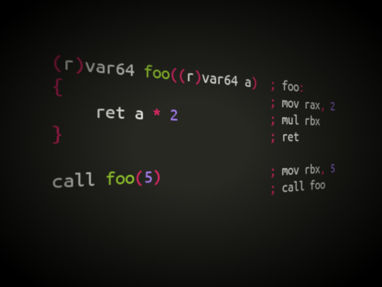
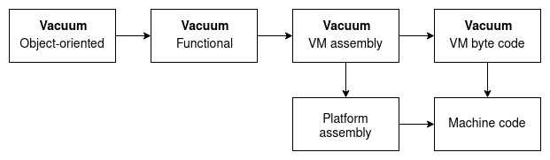

# Vacuum
[](https://www.codefactor.io/repository/github/architector1324/vacuum)

**Vacuum** is a programming language that is an multilevel ***assembler*** that using object-oriented, functional, procedural and low-level paradigms together. This language was created to use the convenient development of **highly optimized programs** for ***cross-platform***, ***embedded systems*** and ***IOT***.

  - **Lower** than ***C***
  - **Powerfull** as ***C++***
  - **Object-oriented** programming like in ***Java***
  - **Package system** like in ***Python***
  - Using it's own **virtual machine** witch assembler is like in ***ARM*** platform



## Compilation stages



## VM assembly
- Memory model - **flat**.
- Registers.
```
  ; 64 bit: r0, r1, r2, r3, r4, r5, r6, r7
  ; 32 bit: r32_0, ..., r32_15
  ; 16 bit: r16_0, ..., r16_31
  ; 8 bit: r8_0, ..., r8_63
  ; 128 bit: r128_0, ..., r128_7

  ; r0 consists of r32_0, r32_1
  ; r32_0 consists of r16_0, r16_1
  ; r16_0 consists of r8_0, r8_1
```

- Sending data.
```
  ; (snd from, to)
  ; snd r, r
  ; snd number, r
  ; snd number, [address]
  ; snd address, r
  ; snd [address], r
  ; snd r, [address]
  ; snd address, [address]
  ; snd [address], [address]
```

- Math
```
  ; (add to, from, from)
  ; add r, r, r
  ; add r, number, r
  ; add r, r, number
  ; add r, number, address
  ; add r, address, number
  ; add r, number, [address]
  ; add r, [address], number
  ; add r, number, number
  ; add r, [address], [address]  
  ; add [address], r, r
  ; add [address], number, r
  ; add [address], r, number
  ; add [address], number, address
  ; add [address], address, number
  ; add [address], number, [address]
  ; add [address], [address], number
  ; add [address], number, number
  ; add [address], [address], [address]  

  ; (mul to, from, from)
  ; (div to, numerator, denomimator)
  ; (or to, from, from)
  ; (and to, from, from)
  ; (xor to, from, from)
  ; same

  ; (not from, to)
  ; not r, r
  ; not number, r
  ; not number, [address]
  ; not address, r
  ; not [address], r
  ; not r, [address]
  ; not address, [address]
  ; not [address], [address]

  ; (inc from, to)
  ; (dec from, to)
  ; same
```

- Goto.
```
  ; go [address]
  ; go r
  ; go [r]  
```

- Stack.
```
  ; push any
  ; pop any
```

## Basics
This documentation using the **x86_64** platform as example. For other platforms everything is same exclude registers and some instructions, specified to current platform.

- Declaration variables.
```
  var8 b(5)     ; nasm equalent is b db 5
  var16 w(5)    ; w dw 5
  var32 d(5)    ; d dd 5
  var64 q(5)    ; q dq 5
  var128 t(5)   ; t dq 0, 5
```

- Changing variable value.
```
  var64 a(5)   ; a dq 5
  snd 7, a     ; mov qword[a], 7
```

- Declaration static array.
```
  var64[4] arr(1, 2, 3, 4)   ; arr dq 1, 2, 3, 4
  var64[] arr1(1, 2, 3, 4)   ; arr1 dq 1, 2, 3, 4
  var8[] str('Hello!', 10)   ; str db 'Hello!', 10
```

- Changing static-array values.
```
  var64[] arr(1, 2, 3)   
  snd 4, [arr]               
  snd 1, [arr + 8]

  snd 4, arr[0]   ; better way
  snd 1, arr[1]
```

- Declaration pointers.
```
  var8 a(5)         ; a db 5
  var8 b(7)         ; b db 7
  var64 c(8)        ; c dq 8

  var8 ptr p(a)     ; p dq a
  snd b, p          ; mov qword[p], b (ok)
  snd c, p          ; error, ptr have different type than pointed variable
```

- Changing variable value by pointer.
```
  var64 a(5)
  var64 ptr p(a)

  snd 7, [p]       ; equalent snd 7, a
```

- Declaration changeable type pointers.
```
  var8 a(5)         ; a db 5
  var8 b(7)         ; b db 7
  var64 c(8)        ; c dq 8

  vacuum ptr p(a)   ; p dq a
  snd b, p          ; ok
  snd c, p          ; ok
```

- Declaration struct.
```
  (var8, var64) some('a', 5)                  ; some db 'a', 0, 0, 5, 0
  (var64, (var8, var64)) some0(7, ('a', 5))   ; some0 db 0, 0, 7, 0, 'a', 0, 0, 5, 0
```

- Changing struct value.
```
  (var8 , var64) some('a', 5)
  snd [some], 'b'
  snd [some + 1], 7

  snd 'b', some[0]   ; better way
  snd 7, some[1]

```

- Declaration union.
```
  (var8, var64) pac my_union('a')

  snd 'b', my_union[0]
  snd 8, my_union[1]
```

- Declaration enumeration.
```
  var8 enum nums(ONE, TWO, THREE)
  var64 enum dogs(KENNY, PENNY)

  snd nums.ONE, r0     ; mov rax, 0
  snd nums.TWO, r0     ; mov rax, 1

  snd dogs.KENNY, r0   ; mov rax, 3
```

- Changing the values of several variables or registers.
```
  var8 a(5)
  var64 b(7)

  snd  (6, 8, 9), (a, b, r0)   ; equalent mov byte[a], 6
                               ;          mov qword[b], 8
                               ;          mov rax, 9
```

- Using expressions in declarations and changing variables.
```
  var64 a(5 + 4)   ; a dq 9
  var64 b(a * 3)   ; b dq 0
                   ; mov rax, [a]
                   ; mul 3
                   ; mov [b], rax
```
```
  var64 a(5)       ; a dq 5
  snd a + 4, r0    ; mov rax, [a]
                   ; add rax, 4
  snd r0++, a      ; inc rax
                   ; mov [a], rax
```

- Declaration unchangeable variable.
```
  final var64 a(5)   
  snd 7, a           ; error
```

- Declaration reference (non-changeable pointer).
```
  var64 a(5)
  var64 b(6)
  var64 final ptr p(a)

  snd b, p               ; error
```

- Declaration register-binded variables.
```
  (r0)var64 a(5)   ; mov rax, 5

  snd 8, a         ; ok
  snd 8, r0        ; error while variable a is in scope (see Methods chapter)
```

- Registers template.
```
  (r)var64 a(5)   ; mov rbx, 5
  (r)var8 b(7)    ; mov cl, 7
  snd 8, r0       ; ok
```

- Declaration register-soft-binded variable (reference).
```
  var64(r0) a(5)   ; mov rax, 5
  snd 7, r0        ; ok
  snd 7, a         ; same
```

- Declaration pointer to register.
```
  var64 ptr(r) p(r0)   ; abstract instruction
  snd 5, [p]           ; mov rax, 5
  snd r1, p            ; ok (abstract instruction)
```

- Declaration registers-binded array (for x86_64 platform: var64 max 6 elements, var32 - 12, var16 - 24, var8 - 48).
```
  (r)var64[6] arr(1, 2, 3, 4, 5, 6)   ; mov rax, 1
                                      ; mov rbx, 2
                                      ; mov rcx, 3
                                      ; mov rdx, 4
                                      ; mov rsi, 5
                                      ; mov rdi, 6
```

- Declaration register-binded values in struct.
```
  (var8, (r)var64) some('a', 5)   ; some db 'a'
                                  ; mov rax, 5
```

- Declaration variables in stack.
```
  (s)var8 a(5)                        ; push 5
  (s)var64[] arr(1, 2, 3)             ; push 1
                                      ; push 2
                                      ; push 3

  (s)var8[] str('HelloWorld123456')   ; push 'HelloWor'
                                      ; push 'ld123456'
```

## Methods
- Declaring a simple method with no return value.
```
  vacuum foo() {}   ; foo: ret
```

- Every program **should have method** *main()*, else code will be executed from **first instruction**.

```
  vacuum main() {}   ; main: ret
  snd 7, r0          ; code started here else
```

- The function declaration with the return value. The value is returned to the stack.
```
  var64 foo()   ; foo:
  {
      ret 5     ; mov qword[rsp + 8], 5
  }             ; ret

  call foo()    ; push 0
                ; call foo
```

- Declaring the function with single instruction.
```
  vacuum foo() snd 5, r0   ; foo:
                           ; mov rax, 5
                           ; ret
  call foo()               ; call foo
```
```
  var64 foo() ret 5        ; foo:
                           ; mov qword[rsp + 8], 5
                           ; ret
  call foo()               ; call foo
```

- Functions can also return a value in a register using register-binded declaration. After returning a value, register unbind automatically.
```
  (r)var64 foo()   ; foo:
  {
      ret 5        ; mov rax, 5
  }                ; ret

  call foo()       ; call foo
  snd 7, r0        ; ok
```

- You can use register-soft-binded declaration to return a value of function in register.
```
  var64(r0) foo()    ; foo:
  {
      snd 7, r0      ; mov rax, 7  ; ok
      ret 5          ; mov rax, 5
  }                  ; ret
```

- A function can return multiple values (struct).
```
  ((r)var8, (r)var64) foo()   ; foo:
  {                           ; mov al, 5
      ret 5, 7                ; mov rbx, 7
  }                           ; ret

  call foo()                  ; call foo
```

- The **vacuum** language also allows for flexibility in function calls. You can use the standard method of calling a function with saving the address of the subsequent instruction **to the stack**, or another way with saving this address **into the register**. This is called a ***register-call function***.
Strongly **not recommended** to use call and register-call at the same function in program, because of double code.
```
  vacuum foo() {}   ; foo: ret
                    ; foo_rcall: jmp rax

  call foo()        ; call foo
  call(r) foo()     ; lea rax, [$ + 8 + 2]
                    ; jmp foo_rcall
```

- The function declaration with the transfer of parameters through the stack.
```
  vacuum foo(var64 a) {}   ; foo: ret
  call foo(7)              ; push 7
                           ; call foo
```
- Passing parameters to a function can also occur through registers. After calling the function, the registers are unbind.
```
  vacuum foo((r)var64 a) {}   ; foo: ret
  call foo(7)                 ; mov rax, 7
                              ; call foo
```

- Local variables that are in scope are by default placed on the stack. However, you can arrange them in memory or registers.
```
                      ; c dq 5
  vacuum foo()        ; foo:
  {
      var64 a(5)      ; push 5
      (s)var64 b(5)   ; push 5
      (m)var64 c(5)   ;
      (r)var64 d(5)   ; mov rax, 5
                      ; sub rsp, 16
  }                   ; ret
  snd 7, r0           ; ok
```


- Polymorphism of functions.
```
  vacuum foo() {}       ; foo_0 : ret
  vacuum foo(var64 a)   ; foo_1: ret

  call foo()            ; call foo_0
  call foo(5)           ; push 5
                        ; call foo_1

```

- Declaration of a variable with the value of a function.
```
  var64 foo()      ; foo :
  {
      ret 5        ; mov qword[rsp + 8], 5
  }                ; ret
  var64 a(foo())   ; a dq 0
                   ; push 0
                   ; call foo
                   ; pop qword[a]
```

- Declaration of a variable on the stack with the value of a function.
```
  var64 foo()         ; foo :
  {
      ret 5           ; mov qword[rsp + 8], 5
  }                   ; ret
  (s)var64 a(foo())   ; push 0
                      ; call foo
```

- Declaration of a register-binded variable with the value of a register-binded function.
```
  (r)var64 foo()      ; foo:
  {
      ret 5           ; mov rax, 5
  }                   ; ret
  (r)var64 a(foo())   ; call foo
```

- Declaration automatic placed variables
```
  (a)var64 a(5)                     ; a dq 5

  vacuum foo()
  {
      (a)var64 b(7)                 ; mov rax, 7
      (a)var8[8] str('qwerty12')    ; mov rbx, 'qwerty12'

      (a)var64[4] arr(1, 2, 3, 4)   ; mov rcx, 1
                                    ; mov rdx, 2
                                    ; mov rsi, 3
                                    ; mov rdi, 4
      (a)var64 c(3)                 ; push 3
  }
```
```
  (a)var8 foo()      ; s_foo:
  {                  ; mov [rsp + 8], 5
      ret 5          ; ret
  }

                     ; r_foo:
                     ; mov rax, 5
                     ; ret

  (s)var8 a(foo())   ; push 0
                     ; call s_foo
  (r)var8 c(foo())   ; call r_foo
```

- Declaration of a pointer to function.
```
  var64 foo(var64 a, var8 b)      ; foo:
  {
      ret 0                       ; mov qword[rsp + 24], 0
  }                               ; ret
  var64 foo2(var64 a, var8 b)     ; foo2:
  {
      ret 1                       ; mov qword[rsp + 24], 1
  }                               ; ret

  var64 ptr p(var64, var8)(foo)   ; p dq foo
  call p(5, 7)                    ; push 0
                                  ; push 5
                                  ; push 7
                                  ; call [p]

  snd foo2, p                     ; mov qword[p], foo2
  call p(5, 7)                    ; call [p]
```

- Declaration of a delegate (pointer to any function).
```
  var64 foo(var64 x, var8 y) ret 5
  vacuum foo2(var8 x) {}

  vacuum dgt my_delegate(foo)
  call my_delegate(5, 7)

  snd  foo2, my_delegate
  call my_delegate(9)

  ; IMPLEMENTS AS

  (var64 ptr(var64, var8), vacuum ptr(var8)) pac dgt_my_delegate(foo)
  call dgt_my_delegate[0](5, 7)

  snd foo2, dgt_my_delegate[1]
  call dgt_my_delegate[1](9)
```

- You can use polymorph functions in delegates too.
```
  var64 foo(var64 x, var8 y) ret 5
  vacuum foo(var8 x) {}

  vacuum dgt my_delegate(foo)
  call my_delegate(5, 7)
  call my_delegate(9)
```

- Declarating safe method (method that can't change global variables, values by addresses, registers and call other non-safe methods). Before delcarating register-binded local variables in the body of method, compiler automatically push it in stack.
```
  var64 a(5)           ; a dq 5

  vacuum prefoo() {}   ; prefoo: ret

  vacuum foo() safe    ; foo:
  {                    ; push rax
      var64 b(5)       ; push 5
      (r)var64 c(6)    ; mov rax, c

      snd 7, a         ; error
      snd a, b         ; ok
      snd 8, c         ; ok

      call prefoo()    ; error
                       ; pop rax
                       ; pop rax
  }                    ; ret
  call foo()           ; call foo
```

- In the **vacuum** language, despite the nature of the assembler, it is impossible to execute the ***jmp*** instruction, since it's not safe. Instead, so-called ***direct-calls*** of methods were introduced. It is **not recommended** to use such calls in different parts of the program, as this leads to duplication of code.
```
  vacuum foo() {}   ; foo: jmp foo_ret

  call(m) foo()     ; jmp foo
  ;some code        ; foo_ret:
```
- Encapsulation of methods. You can declare methods inside methods.
```
  vacuum foo()         ; foo:
  {                    ; mov rax, 5
      vacuum same()    ; foo_same:
      {
          snd 7, r0    ; mov rax, 7
      }                ; ret
      snd 5, r0
      call(m) same()     
  }               

  call foo()           ; call foo
  call same()          ; error
```

- Conditional-calls (only for direct and register calls). By default, conditional-call is a direct-call.
```
  vacuum foo() {}         ; foo: jmp foo_ret

  (5 = 5)call(m) foo()    ; cmp 5, 5
                          ; je foo
  (5 = 5)call foo()       ; same
```
```
  vacuum foo() {}         ; foo: jmp rax

  (5 = 5)call(r) foo()    ; cmp 5, 5
                          ; lea rax, [$ + 8 + 2]
                          ; je foo
```
```
  (5 = 5)call(m) foo()    ; je foo
  (3 != 5)call(m) foo()   ; jne foo
  (3 < 5)call(m) foo()    ; jl foo
  (5 > 3)call(m) foo()    ; jg foo
  (3 <= 5)call(m) foo()   ; jle foo
  (3 >= 5)call(m) foo()   ; jge foo
```

- Conditional instruction.
```
  (5 < 3)snd 7, r0   ; cmp 5, 3
                     ; jge next
                     ; mov rax, 7
                     ; next:
```

- In the **vacuum** language there are ***no cycles***, recursions are used instead.
```
  vacuum while_true()             ; while_true:
  {
      call(m) while_true()        ; jmp while_true
  }                               ; ret

  vacuum for((r)var64 i)          ; for:
  {                               ; cmp rax, 100
      (i < 100)call(m) for(i++)   ; inc rax
                                  ; jl for
  }                               ; ret

  call for(0)                     ; xor rax, rax
                                  ; call for
  call while_true()               ; call while_true
```

- Declaring an anonymous function.
```
  vacuum ()       ; anon:
  {
      snd 4, r0   ; mov rax, 4
  }               ; ret
```
```
  vacuum foo(var64(r0) a, (r1)((r2)var64) ptr callback())   ; foo:
  {                                                         ; call rbx
      snd a + callback(), r0                                ; add rax, rcx
  }                                                         ; ret

                                                            ; anon:
                                                            ; mov rcx, 5
                                                            ; ret

  call foo(4, (r2)var64(){ret 5})                           ; mov rax, 4
                                                            ; mov rbx, anon
                                                            ; call foo
```                                                

- Encapsulated methods with a **public** access modifier can be called from outside. It is a ***deep-call***.
```
  vacuum foo((r)var64 a)                 ; foo: ret
  {
      public (r)var64 some((r)var64 b)   ; foo_some:
      {                                  ; mov rcx, rax
          ret a + b                      ; add rcx, rbx
      }                                  ; ret
  }

  call foo(1).some(2)                    ; mov rax, 1
                                         ; mov rbx, 2
                                         ; call foo_some
```

- Inheritance of methods.
```
  vacuum foo((r)var64 a)                         ; foo: ret
  {
      protected (r)var64 some((r)var64 b)        ; foo_some:
      {                                          ; mov rcx, rax
          ret a + b                              ; add rcx, rbx
      }                                          ; ret
  }

  (r)var64 Foo() extends foo(1)                  ; Foo:
  {                                              ; mov rbx, 2
      ret some(2)                                ; call foo_some
  }                                              ; ret

  call some()                                    ; error
  call foo(1).some(2)                            ; error

  call Foo()                                     ; mov rax, 1
                                                 ; call Foo
```

## Object-oriented
...soon
