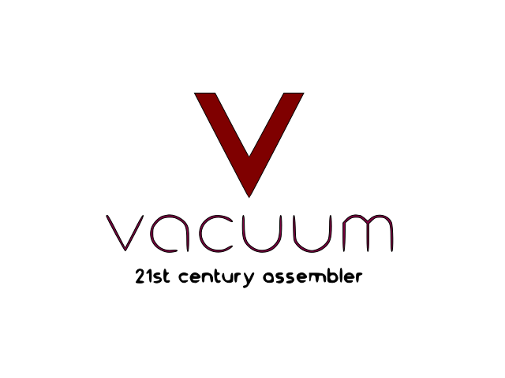
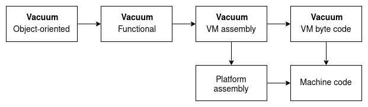

**Vacuum** is a programming language that is an multilevel ***assembler*** that using object-oriented, functional, procedural and low-level paradigms together. This language was created to use the convenient development of **highly optimized programs** for ***cross-platform***, ***embedded systems*** and ***IOT***.

  - **Lower** than ***C***
  - **Powerfull** as ***C++***
  - **Object-oriented** programming like in ***Java***
  - **Package system** like in ***Python***
  - Own **virtual machine** witch assembler is like in ***ARM*** platform
  - **FSM** using instead ***conditionals***
  - **Multithreading** implements as ***NFA***

## Compilation stages

## Docs
- [Wiki](https://github.com/architector1324/vacuum/wiki)
